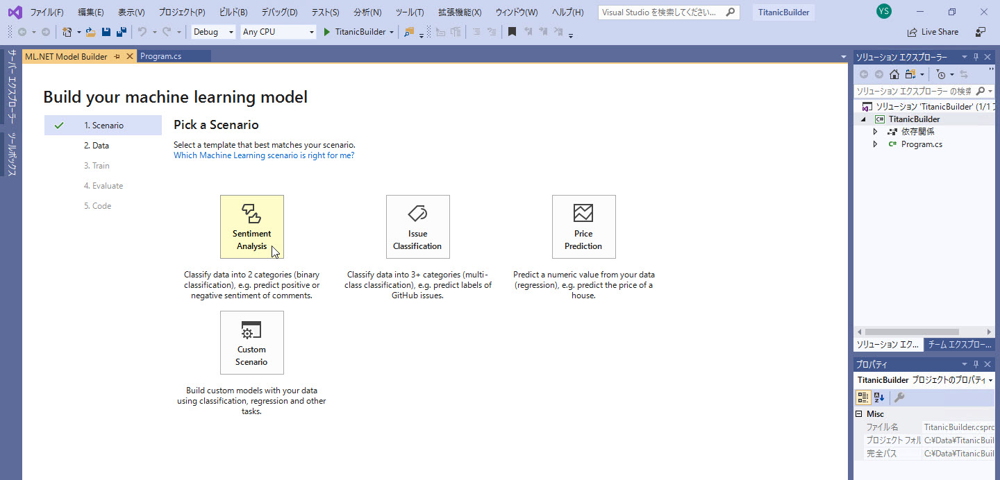

# モデルを作成する

[前のステップ](./01_preparedata.md) で、学習に使用するデータを用意しました。

このステップでは、[**ML.NET Model Builder**](https://dotnet.microsoft.com/apps/machinelearning-ai/ml-dotnet/model-builder) を使って、

- シナリオ選択（二項分類、他行分類、回帰）
- データセットの選択と予測対象の指定
- 訓練
- 評価

を行います。  
Model Builder では、ここまでは **マウス操作だけ** で完結します。コーディング不要なので、簡単に学習が完了します。

Model Builder には、他の以下の特徴があります。

- ローカルのみで開発（開発にはクラウド不要）
- .NET Standard との互換性（ビジネスアプリケーションなどに組み込みやすい）
- DevOps 統合
- 無償

---

## 開発環境の構築

ML.NET Model Builder の開発環境を構築します。

> ML.NET Model Builder は **macOS** や **Linux** でも実行可能ですが、このコンテンツでは **Windows 上の Visual Studio** で開発を進めます。

以下をダウンロード、インストールします。

- [**Visual Studio**](https://visualstudio.microsoft.com/ja/vs/) 2019 または 2017 (15.9.12 以上)  
  インストール時のワークロードは、

  - ASP.NET と Web 開発
  - Azure の開発
  - .NET Core クロスプラットフォームの開発

  を選択してください。
- .NET Core 2.1 SDK  
  Visual Studio で上記のワークロードを選択していれば一緒にインストールされるはず
- [ML.NET Model Builder](https://marketplace.visualstudio.com/items?itemName=MLNET.07)

> このコンテンツでは Visual Studio 2019 を使用しています。  
> Visual Studio 2017 を使用する場合は、各画面やメニューについては適宜読み替えるなどして進めてください。

---

## プロジェクトの新規作成

環境が整ったので、Visual Studio のプロジェクトを新規作成します。

1. Visual Studio を起動して、[**新しいプロジェクトの作成**] を選択します。  
    

2. [**コンソールアプリ (.NET Core)**] を選択して [**次へ**] をクリックします。  
   

3. [**プロジェクト名**] を入力します。ここでは "**TitanicBuilder**" として進めます。  
   [**場所**] は任意の場所を指定します。  
   

4. [**作成**] をクリックして少し待つと、プロジェクトが作成されます。

ここで作成した "コンソールアプリ" は実際には使いません。  
今のところ、ML.NET Model Builder を起動するには、".NET Core コンソールアプリ" のプロジェクトが必要なようです。

---

## Model Builder の実行

Model Builder を実行して、学習完了まで一気に進めます。

1. "**ソリューションエクスプローラー**" の [**TitanicBuilder**] プロジェクトで右クリックして、[**追加**]-[**Machine Learning**] を選択します。
   

2. **シナリオ** を選択します。  
   今回は "**Sentiment Analysis**" を選択します。
   

   > シナリオの選択が少しわかりづらいかもしれません。
   > 予測したい内容に応じて、以下を選択します。
   >
   > |予測したい内容|シナリオ名|
   > |---|---|
   > |二項分類|Sentiment Analysis|
   > |多項分類|Issue Classification|
   > |回帰|Price Predict|
   >
   > 二項分類として "Sentiment Analysis" しかできないわけではありません。

3. データセットを選択して、予測対象のカラムを選択します。  
   1. [**Data Source**] で "**File**" を選択します。
   2. [**Select a file**] で、[前のステップ](./01_preparedata.md) でダウンロードした "**train.csv**" を選択します。
   3. [**Column to Predict (Label)**] で "**Survived**" を選択します。これは、予測対象が Survived であることを指定しています。
   4. [Next step: **train**] をクリックします。

   

4. [**Start training**] をクリックします。  
   

5. [**Progress**] に進捗が表示されます。  
   [**Status**] が "**Done**" になり [**Best Accuracy**] に精度が表示されれば、学習は完了です。  
   [Next step: **Evaluate**] をクリックして、評価に進みます。
   

6. [**Evaluate**] が表示されます。  
   精度の高いモデルの上位 5件が表示されます。
   

7. [Next step: **Code**] をクリックします。
8. [**Add Projects**] をクリックして、Model Builder で自動生成されたプロジェクトをソリューションに追加します。  
   

9. ソリューションに 2個のプロジェクトが追加されます。  
    
10. 学習済みモデルが "MLModel.zip" というファイル名で保存されていることを確認します。    
    

---

## 自動生成されたアプリケーションを実行してみる

前の手順までで、学習に成功することが分かりました。  
また、学習するためのアプリケーションのプロジェクトが自動的に生成されました。

このアプリケーションを実行してみます。  
コードを変更・修正して再学習したい場合などに、このアプリケーションが必要になります。ここで動作確認をしておきます。

1. ソリューションエクスプローラーで、"新規作成されたコンソールアプリ" ("**TitanicBuilderML.ConsoleApp**" のような名前になっているはずです) を右クリックして、[**スタートアッププロジェクトに設定**] を選択します。  
   

2. "F5" キー、または [デバッグ]-[デバッグ実行] で、コンソールアプリを実行します。  
   コンソールウィンドウが開き、アプリケーションが実行されます。  
   1行分のデータについて、"Survived" の実際の値と予測した値とが表示されます。例えば以下のように表示されます。

   ```cmd
   Single Prediction --> Actual value: False | Predicted value: False
   =============== End of process, hit any key to finish ===============
   ```

   

3. 何かキーを押して、コンソールアプリを終了します。

---

以上で、データの読み込みから学習済みモデルの保存まで完了しました。

すべてマウス操作だけであり、コードは全く書いていません。  
コーディングに起因する不具合などは発生せず、高速に学習が完了することが分かりました。

[次のステップ](./03_createfunctions.md) では、**Azure Functions** の関数として、**予測サービス** を作成します。
