# 予測をサービス化する

[前のステップ](./02_buildmodel.md) で、学習が完了しました。

ここからは、予測モデルを **Azure Functions** の関数としてホストして、サービスとして利用できるようにします。

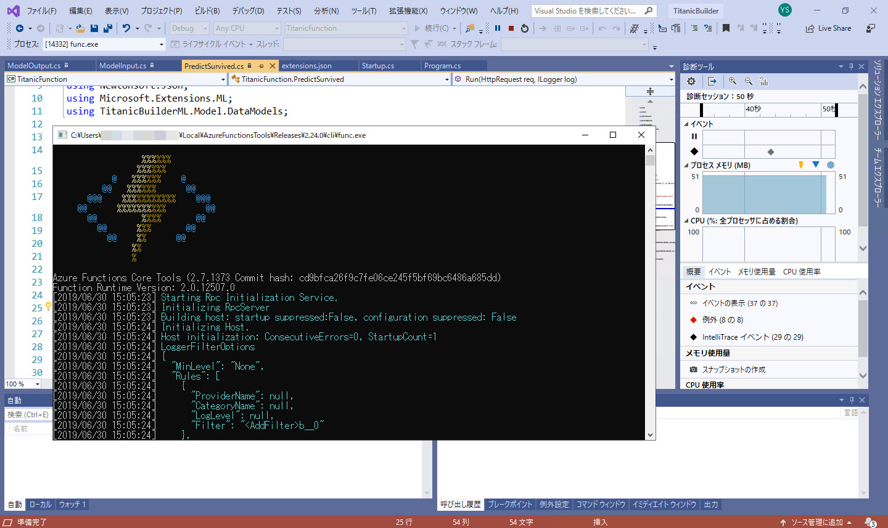

> ここで作成する関数は、Visual Studio Code で [ML.NET で二項分類 で作成した関数](https://github.com/seosoft/Titanic_MLNet/blob/master/06_createfunctions.md) と同等のものです。  
> ここでは Visual Studio を使って、関数を作ってみます。

---

## Azure Functions の新規プロジェクトを追加する

学習済みモデルを使用して予測を行う Azure Functions プロジェクトを新規作成します。

1. ソリューションエクスプローラーの "**ソリューション**" で右クリックして、[**追加**]-[**新しいプロジェクト**] を選択します。  
   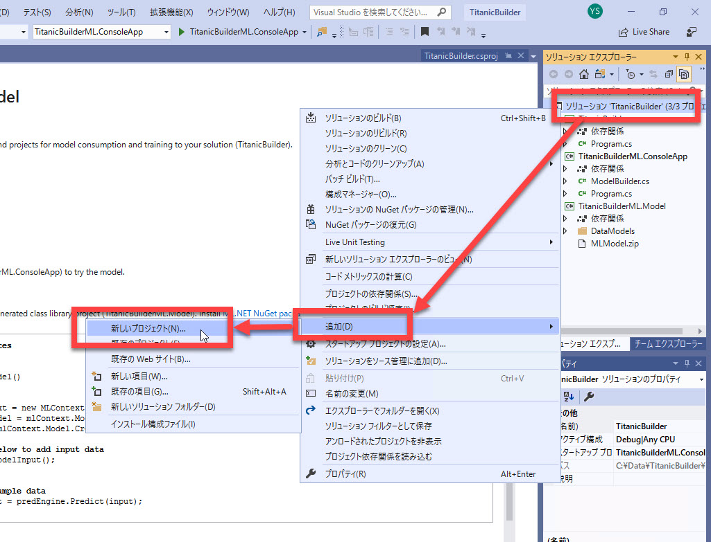

2. "新しいプロジェクトを追加" ウィザードで、検索ボックスに "**functions**" と入力します。  
   検索結果に [**Azure Functions**] が表示されるので、これを選択して [**次へ**] をクリックします。  
   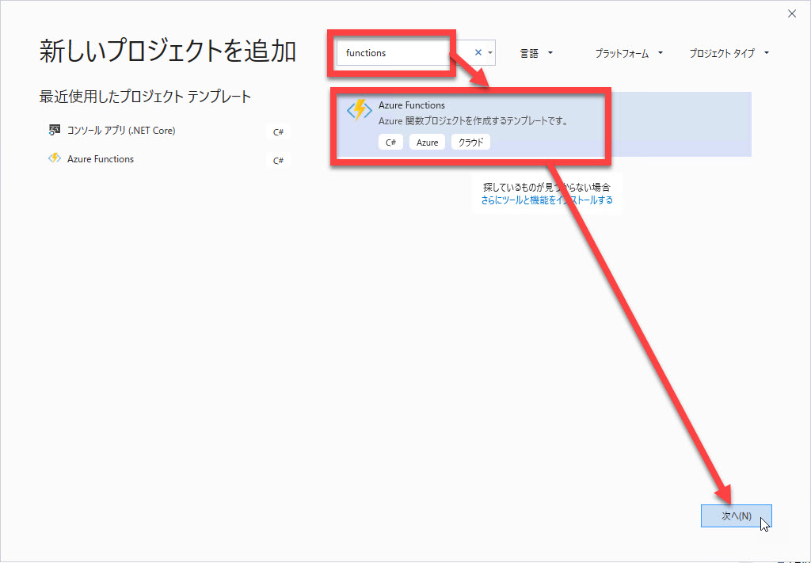

3. [**プロジェクト名**] を入力します。ここでは "**TitanicFunction**" とします。  
   続いて [**作成**] をクリックします。
   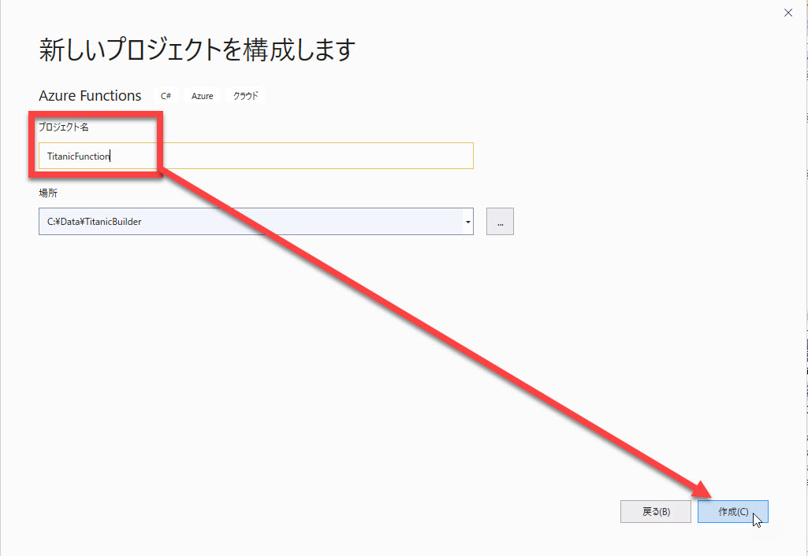

4. [**バージョン**] で "**Azure Functions v2(.NET Core)**" を選択します。
5. [**トリガー**] で "**Http trigger**" を選択します。
6. [**ストレージアカウント**] で "**ストレージエミュレーター**" を選択します。
7. [**Access Rights**] で "**Function**" を選択します。
8. [**作成**] をクリックします。
   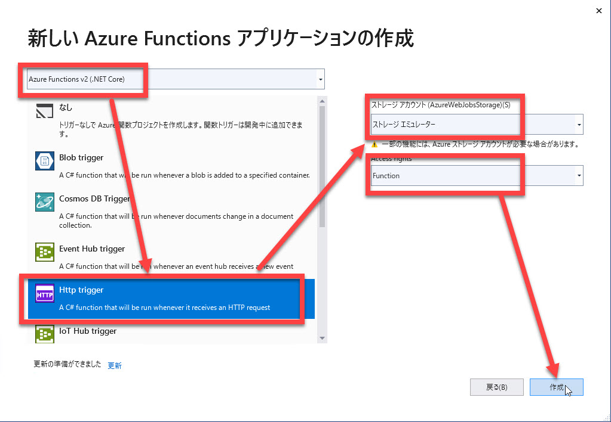

---

## Microsoft.ML, Microsoft.Extensions.ML パッケージのインストール

新しく作成した Functions プロジェクトに "Microsoft.ML" パッケージをインストールします。

1. ソリューションエクスプローラーで、新しく作成した "**TitanicFunction**" プロジェクトを右クリックします。  
   続いて、[**NuGet パッケージの管理**] を選択します。
   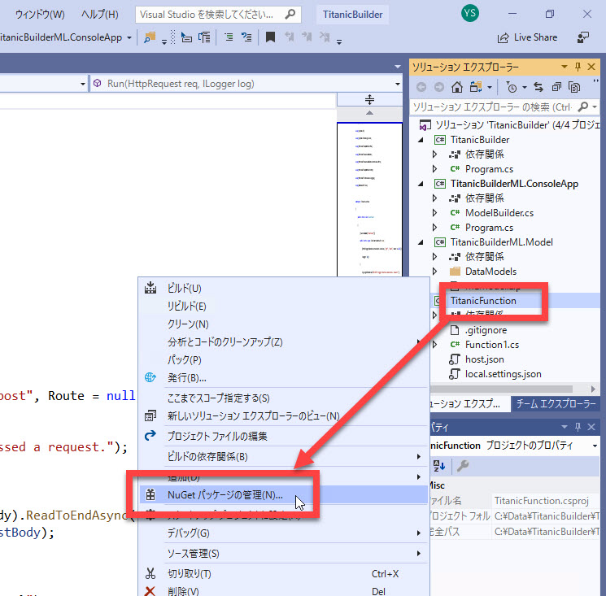

2. [NuGet パッケージマネージャー] で [**参照**] をクリックして、 検索ボックスに "microsoft.ml" と入力します。
3. 検索結果に表示される "**Microsoft.ML**" を選択して、[**インストール**] をクリックしてパッケージをインストールします。  
   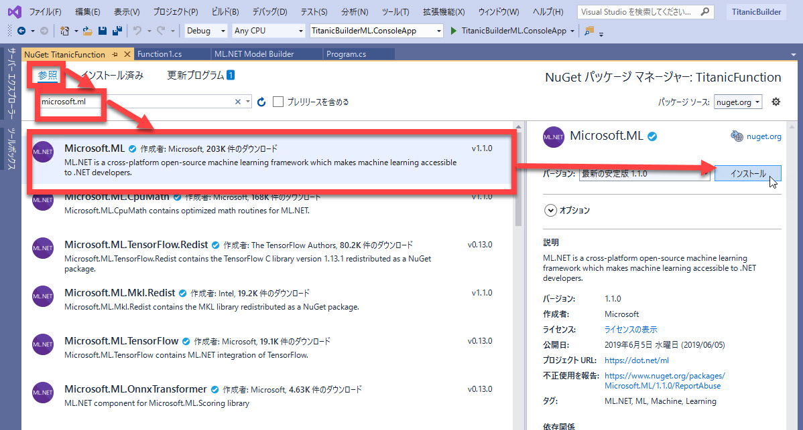

4. 同様の操作で "**Microsoft.Extensions.ML**" をインストールします。
   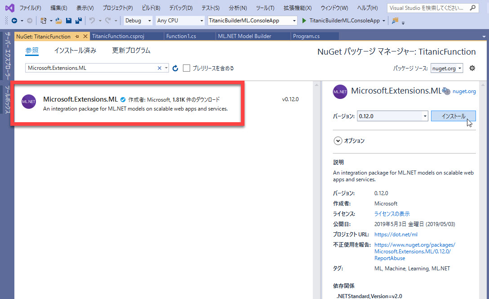

   > [**更新プログラム**] がある場合は、適宜更新してください。

---

## Model プロジェクトを参照設定する

Function App プロジェクトで、Model Builder が自動生成した "Model" プロジェクトを参照設定します。  
これにより、Function App で Titanic に特化したモデルクラスを利用できるようになります。

1. ソリューションエクスプローラーの "TitanicFunction" プロジェクトの [**依存関係**] で右クリックします。  
   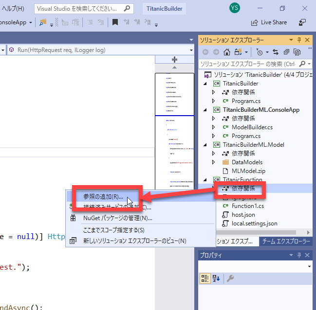

2. "**TitanicBuildML.Model**" をチェックして [**OK**] します。  
   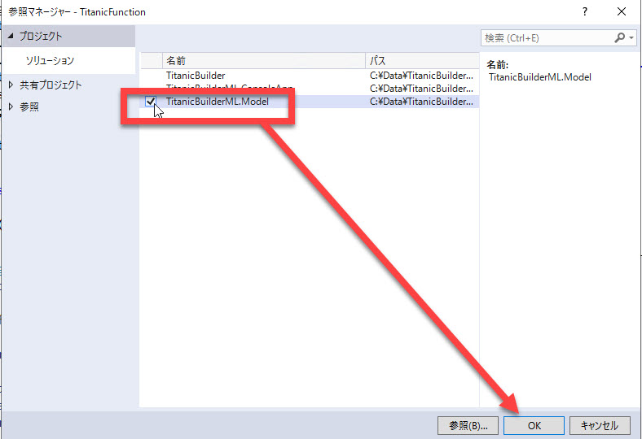

---

## 学習済みモデルをプロジェクトフォルダー内に配置

 自動生成された **学習済みモデル** (MLModel.zip) ファイルを予測サービスのプロジェクトにコピーします。

1. ソリューションエクスプローラーの "**TitanicFunction**" で右クリックして、[**追加**]-[**新しいフォルダー**] を選択します。  
   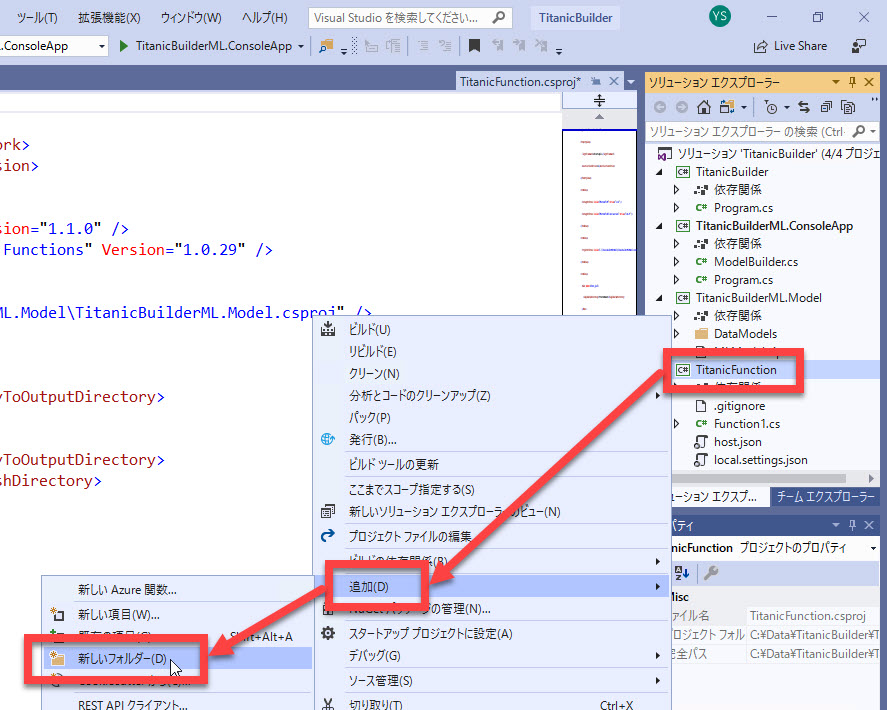

2. 新しいフォルダーは "**Models**" とします。  
   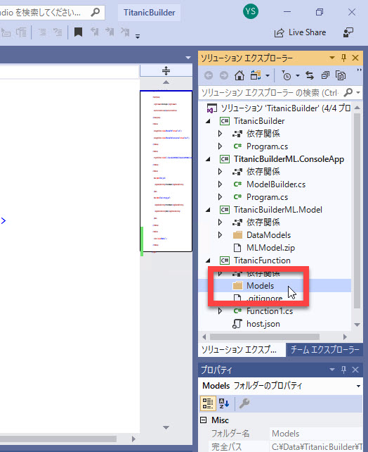

3. ソリューションエクスプローラーで、"**MLModels.zip**" ファイルを今作った "**Models**" フォルダーに **ドロップ** します。  
   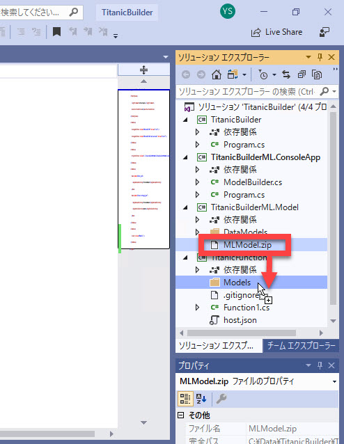

4. "TitanicFunction" プロジェクトにコピーした "**MLModel.zip**" を選択して、プロパティの [**出力ディレクトリにコピー**] を "**新しい場合はコピーする**" に設定します。
   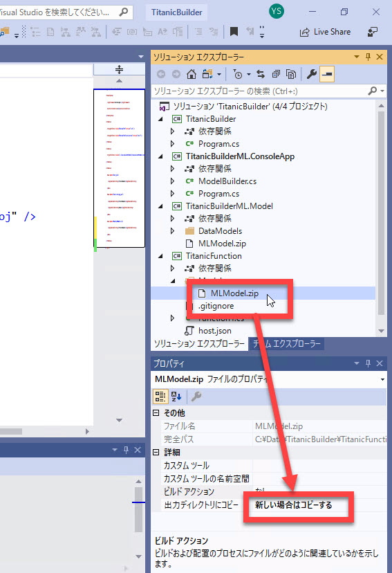

---

## 予測エンジンを追加する

Azure Functions で ML.NET で作成したモデルを使用して予測するには、PredictionEnginePool をプロジェクトに追加します。

1. ソリューションエクスプローラーの "**TitanicFunction**" プロジェクトで右クリックして、[**追加**]-[**クラス**] を選択します。  
追加するファイル名は "**Startup.cs**" とします。  
   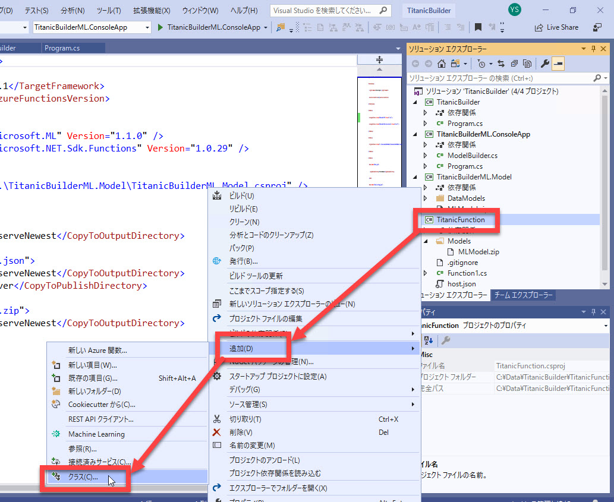

2. "Startup.cs" に以下の内容を貼り付けます。

   ```csharp
   using Microsoft.Azure.WebJobs;
   using Microsoft.Azure.WebJobs.Hosting;
   using Microsoft.Extensions.ML;
   using TitanicBuilderML.Model.DataModels;
   using TitanicFunction;

   [assembly: WebJobsStartup(typeof(Startup))]
   namespace TitanicFunction
   {
       class Startup : IWebJobsStartup
       {
           public void Configure(IWebJobsBuilder builder)
           {
               builder.Services.AddPredictionEnginePool<ModelInput, ModelOutput>()
                   .FromFile("Models/MLModel.zip");
           }
       }
   }
   ```

   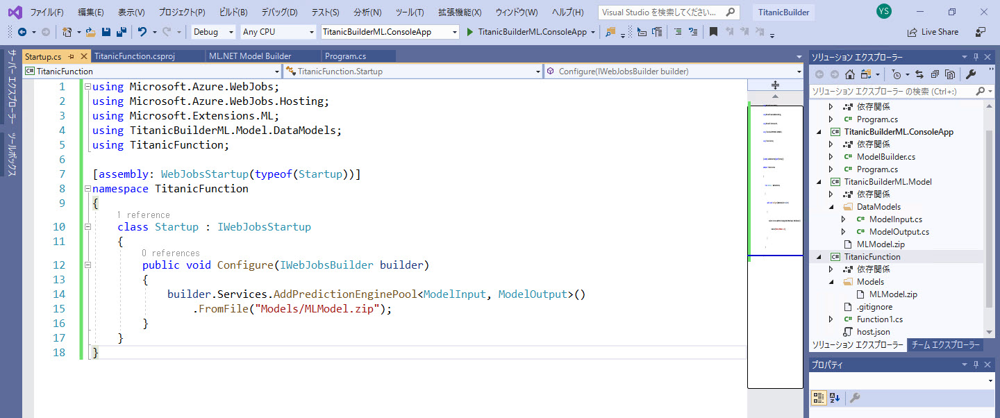

3.ソリューションエクスプローラーの "**TitanicFunction**" プロジェクトで右クリックして、[**追加**]-[**新しい項目**] を選択します。
   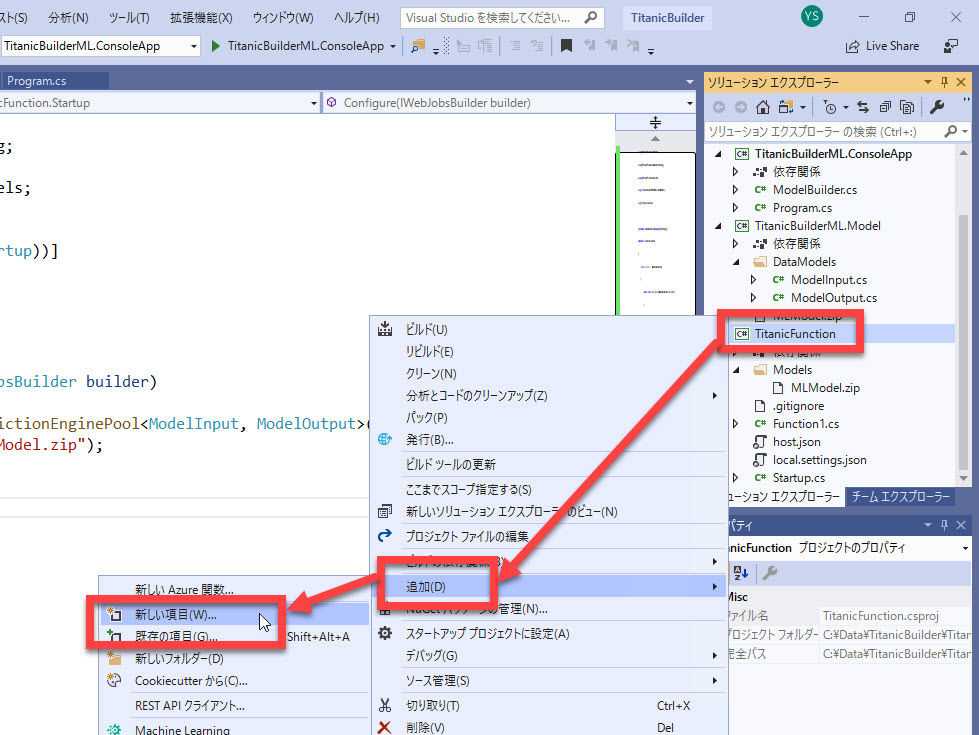
4. 検索ボックスに "json" と入力し、検索結果から "JSON ファイル" を選択します。
5. 名前は "**extensions.json**" とします。  
   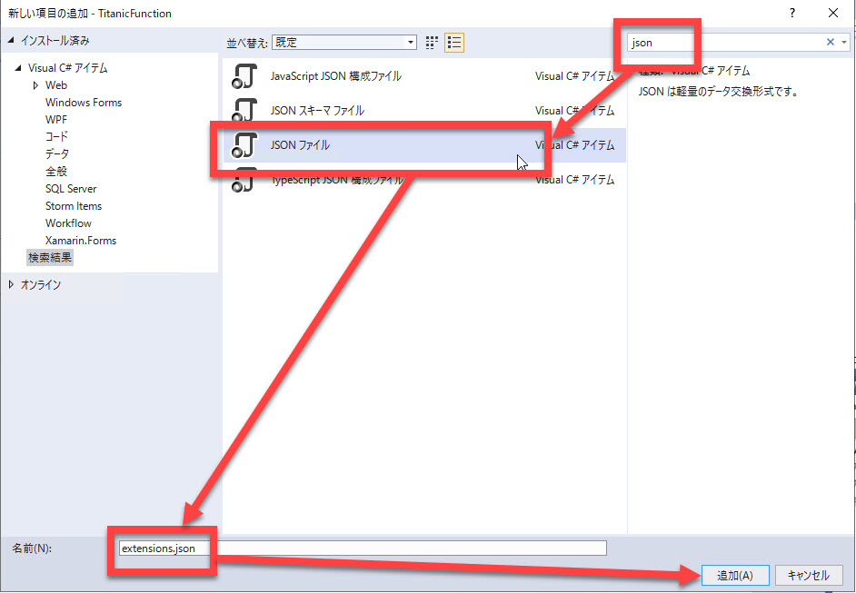
6. "extensions.json" に以下の内容を貼り付けます。  

   ```json
   {
     "extensions": [
       {
         "name": "Startup",
         "typename": "TitanicFunction.Startup, TitanicFunction, Version=1.0.0.0, Culture=neutral, PublicKeyToken=null"
       }
     ]
   }
   ```

7. "**Function1.cs**" を削除します。  

   > "Function1.cs" が残っていても、予測サービスの動作には支障はありません。または "Function1.cs" をリネームして適切なクラス名にして使用することもできます。
   > 今回は "Function1.cs" を削除して、新しい関数を追加することにします。

8. ソリューションエクスプローラーの "**TitanicFunction**" プロジェクトで右クリックして、[**追加**]-[**クラス**] を選択します。  
追加するファイル名は "**PredictSurvived.cs**" とします。  
9. "PredictSurvived.cs" に以下の内容を貼り付けます。  

   ```csharp
   using System;
   using System.IO;
   using System.Threading.Tasks;
   using Microsoft.AspNetCore.Mvc;
   using Microsoft.Azure.WebJobs;
   using Microsoft.Azure.WebJobs.Extensions.Http;
   using Microsoft.AspNetCore.Http;
   using Microsoft.Extensions.Logging;
   using Newtonsoft.Json;
   using Microsoft.Extensions.ML;
   using TitanicBuilderML.Model.DataModels;

   namespace TitanicFunction
   {
       public class PredictSurvived
       {
           [FunctionName("PredictSurvived")]
           public async Task<IActionResult> Run(
               [HttpTrigger(AuthorizationLevel.Function, "get", "post", Route = null)] HttpRequest req,
               ILogger log)
           {
               log.LogInformation("C# HTTP trigger function processed a request.");

               var requestBody = await new StreamReader(req.Body).ReadToEndAsync();
               var data = JsonConvert.DeserializeObject<ModelInput>(requestBody);

               var prediction = _predictionEnginePool.Predict(data);

               var sentiment = Convert.ToBoolean(prediction.Prediction) ? "Survived" : "Not Survived";
               return new OkObjectResult(sentiment);
           }

           private readonly PredictionEnginePool<ModelInput, ModelOutput> _predictionEnginePool;

           public PredictSurvived(PredictionEnginePool<ModelInput, ModelOutput> predictionEnginePool)
           {
               _predictionEnginePool = predictionEnginePool;
           }
       }
   }
   ```

以上で、関数の実装は完了しました。

---

## Postman をインストール

まだ　[**Postman**](https://www.getpostman.com/downloads/) をインストールしていなければ、ここでインストールします。

1. [**Postman**](https://www.getpostman.com/downloads/) をダウンロード、インストールします。
2. Postman を起動します。

---

## 予測サービスを Postman から呼び出す

1. Visual Studio で、"F5 キー" または [**デバッグ**]-[**デバッグの開始**] で実行します。
2. Function が実行されて、ターミナルに URL が表示されます。  
   "**<http://localhost:7071/api/PredictSurvived>**" のような URL になっているはずです。  
   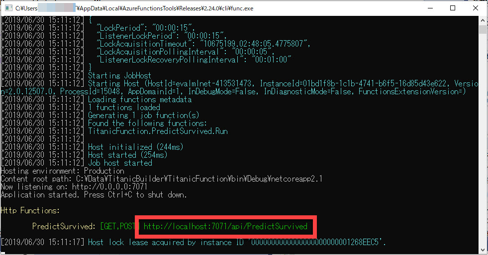

3. Postman に必要な情報を埋めていきます。  
  
   |区分|項目|値|
   |---|---|---|
   |リクエスト|メソッド|POST|
   |リクエスト|URL|すぐ上の手順でターミナルに表示された URL|
   |Header|Content-Type|application/json|
   |Body|("Raw" に切り替えて)|以下のような JSON を入力（値は適当に他の値に変更して）|

   ```json
   {
       "Pclass": 1,
       "Sex": "female",
       "Age": 20,
       "SibSp": 1,
       "Parch": 0,
       "Fare": 30
   }
   ```

   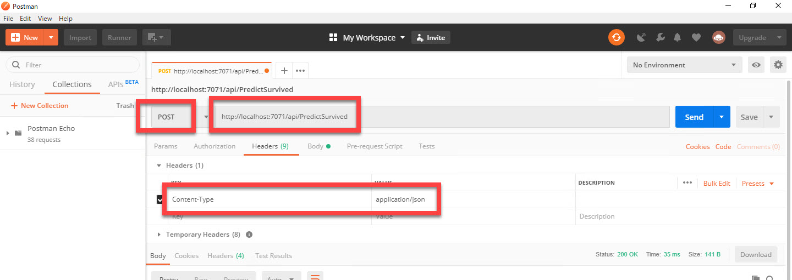
   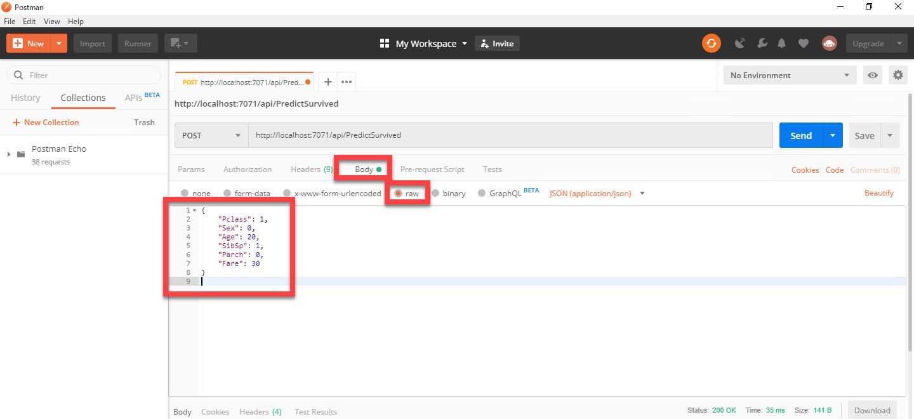

   > PassengerId, Name, Ticket, Cabin, Embarked は、Survu

4. [**Send**] ボタンをクリックします。予測結果（"Survived" または "Not Survived"）が返ってきます。
   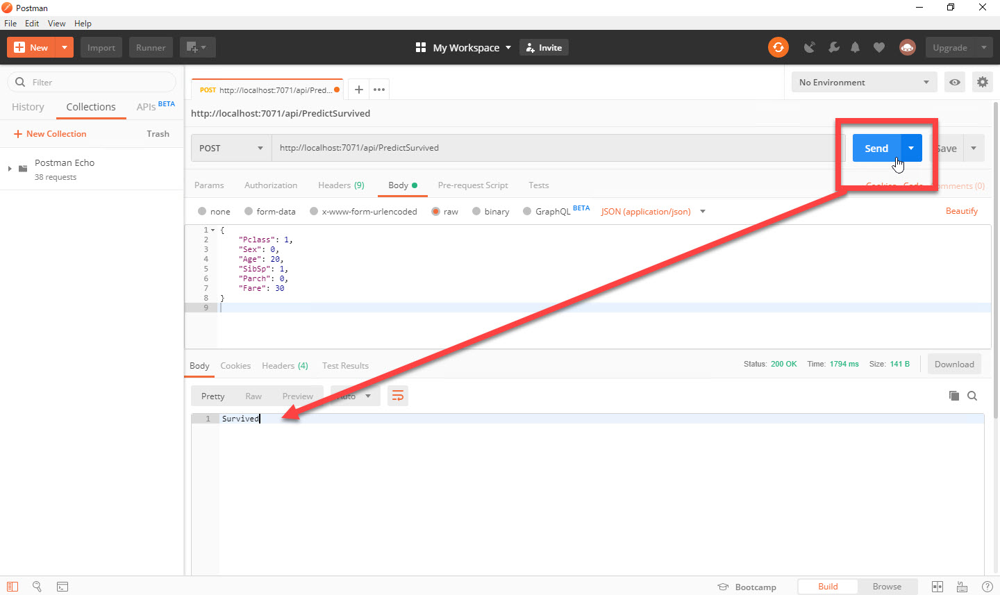

---

以上で、予測サービスの作成と実行、またクライアントからのリクエストができました。  
[**最後のステップ**](./04_deploytoazure.md) では、今作った Function を Azure にデプロイします。
