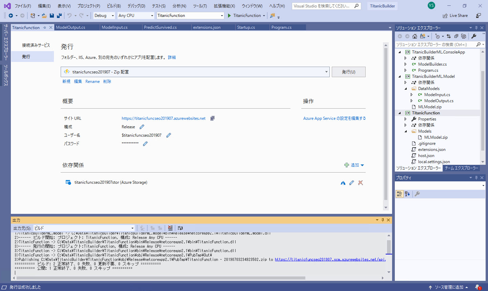
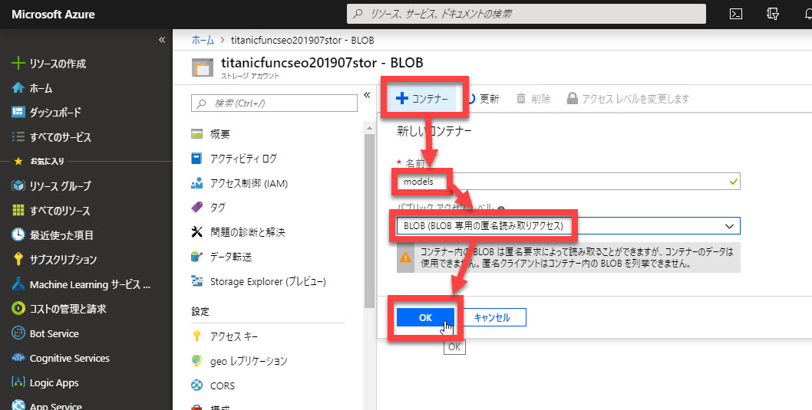
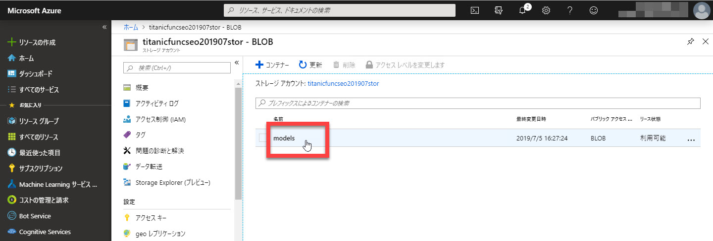

# 予測サービスをクラウドに発行する

[**前のステップ**](./03_createfunctions.md) で、予測サービスを作成して、ローカルでデバッグ実行しました。

このステップではコンテンツの仕上げとして、

- 作成したサービスを Azure に発行
- クライアントから呼び出し

を行います。

> Azure サブスクリプションを持っていない場合は、[こちら](https://azure.microsoft.com/ja-jp/free/) で無償アカウントを作成してください。

---

## Azure Functions に関数を作成する

[前のステップ](./03_createfunctions.md) でローカルでの実行に成功した予測サービスを Azure Functions にデプロイします。

1. ソリューションエクスプローラーの "**TitanicFunction**" プロジェクトで右クリックして、[**発行**] を選択します。  
   

2. "発行先を選択" の "Azure 関数アプリ" で、以下を選択します。  

   - **新規作成**
   - パッケージファイルから実行します

3. [**発行**] をクリックします。  
   

4. "Azure App Service 新規作成" で、以下の様に入力、選択します。

   |項目名|設定値|
   |---|---|
   |名前|全世界で一意な名前（例: "titanicfunc" などと、自分の名前、日付などを組み合わせ）|
   |サブスクリプション|任意|
   |リソースグループ|任意（新規作成）|
   |ホスティングプラン|任意の名前|
   |ホスティングプランの場所|任意のリージョン|
   |ホスティングプランのサイズ|消費|
   |Azure Storage|任意|
   |Azure Storage の場所|任意のリージョン|
   |Azure Storage のアカウントの種類|標準 - ローカル冗長ストレージ|

   

   リソースグループ、ホスティングプラン、Azure Storage の新規作成や作成後の変更は [**新規...**] リンクや **歯車アイコン** で行います。

   
   
   

5. [**発行**] をクリックします。  
   しばらく待つと、発行に成功します。  
   

---

## Function App の設定変更

ML.NET のモデルは、64ビットのプラットフォームで実行する必要があります。

1. [Azure ポータル](https://portal.azure.com/) を開きます。  
2. [**検索ボックス**] に上の手順で作成した App Service 名の先頭を入力します。（例: titanic）
3. 検索結果に表示される "App Service" をクリックします。  
   

4. [**<作成した Function App>**]-[**プラットフォーム機能**] を選択します。  
   ]

5. [**全般設定**]-[**構成**] を選択します。  
   

6. [**プラットフォームの設定**]-[**プラットフォーム**] を "**64 Bit**" に変更して、[**保存**] をクリックします。  
   

---

## Blob に学習済みモデルファイルを配置する

学習済みモデルのファイルを **Blob** ストレージに配置します。  
再学習した際にモデルファイルを変更するだけでより精度の高い予測ができるようになるなどのメリットがあります。

1. Azure ポータルの [**検索ボックス**] に上の手順で作成した Storage 名の先頭を入力します。（例: titanic）
2. 検索結果に表示される "ストレージアカウント" をクリックします。  
   

3. [**BLOB**] を選択します。  
   

4. [**コンテナー**] を選択します。
5. [名前] に "**models**" を指定します。
6. [**パブリックアクセスレベル**] で "**BLOB (BLOB 専用の匿名読み取りアクセス)**"
7. [**OK**] をクリックして、コンテナーを作成します。  
   

8. "**models**" ストレージアカウントを選択します。  
   

9. [**アップロード**] を選択して、"**MLModel.zip**" ファイルをアップロードします。  
     

   > "MLModel.zip" ファイルのソリューション内のパスは、Visual Studio のソリューションエクスプローラーで "MLModel.zip" をクリックすることで分かります。
   >
   > 

10. アップロードに成功したら、"**MLModel.zip**" を選択します。
    

11. "MLModel.zip" の [**URL**] をクリップボードにコピーします。  
    この値はあとで使います。  
    

---

## ソースコードの一部変更

Blob にアップロードした学習済みモデルのファイル "MLModel.zip" を使用して予測するように、ソースコードを変更します。

1. Visual Studio に戻って、"**Startup.cs**" を開きます。
2. "**Configure**" メソッドを以下のように変更します。  

   ```csharp
   public void Configure(IWebJobsBuilder builder)
   {
       builder.Services.AddPredictionEnginePool<Passenger, PassengerPredict>()
           // .FromFile("Models/TrainedModel.zip");
           .FromUri("<Blob ストレージにアップロードした MLModel.zip の URL>");
   }
   ```

   

---

## Function App にデプロイ

ソースコードを変更したので、Function App にデプロイします。

1. ソリューションエクスプローラーで "**TitanicFunction**" プロジェクト を右クリックして、[**発行**] を選択します。  
   

2. [**発行**] をクリックします。  
   

---

## Azure ポータルで動作確認

予測サービスが Azure Functions で動作するようになりました。  
Azure ポータルで動作確認してみます。

1. [Azure ポータル](https://portal.azure.com/) を開きます。  
2. [**検索ボックス**] に上の手順で作成した Function App 名の先頭を入力します。（例: titanic）
3. 検索結果に表示される "App Service" をクリックします。  
   

4. "**Function App ブレード**" が開いたら、[**関数 (読み取り専用)**] のドリルダウンを開いて、"**PredictSurvived**" を選択します。  
   続いて [**テスト**] タブをクリックして広げます。  
   

3. [**要求本文**] に、例えば以下の JSON を入力します。  

   ```json
   {
       "Pclass": 1,
       "Sex": "female",
       "Age": 20,
       "SibSp": 1,
       "Parch": 0,
       "Fare": 30
   }
   ```

   

4. [**実行**] をクリックします。  
   [**出力**] 領域に、予測した結果が表示されます。  
   

Azure Functions 化に成功しました。

---

## 予測サービスを Postman から呼び出す

1. Azure ポータルの "**Function App ブレード**" で、[**関数 (読み取り専用)**] のドリルダウンを開いて、"**PredictSurvived**" を選択します。
2. [**関数の URL の取得**] をクリックします。  
   

3. [コピー] をクリックして、URL をクリップボードにコピーします。  
   

4. Postman を起動して、以下の必要な情報を埋めていきます。  
  
   |区分|項目|値|
   |---|---|---|
   |リクエスト|メソッド|POST|
   |リクエスト|URL|Function App の URL (Azure ポータルでコピーしたもの)|
   |Header|Content-Type|application/json|
   |Body|("Raw" に切り替えて)|以下のような JSON を入力（値は適当に他の値に変更して）|

   ```json
   {
       "Pclass": 1,
       "Sex": "female",
       "Age": 20,
       "SibSp": 1,
       "Parch": 0,
       "Fare": 30
   }
   ```

   > Postman で入力する情報は、[**予測をサービス化する**](./06_createfunctions.md) の "**予測サービスを Postman から呼び出す**" 手順を参考にしてください。  
   >今回違うのは **URL** のみです。

5. [**Send**] ボタンをクリックします。予測結果（"Survived" または "Not Survived"）が返ってきます。  
   

---

以上で、このコンテンツはすべて終了です。

機械学習のデータの用意、学習、クラウドへの発行、クライアントからの利用について、実際に操作してみました。  
Model Builder を使うと非常に簡単に学習できることが分かったと思います。
[公式の Tutorial](https://dotnet.microsoft.com/learn/machinelearning-ai/ml-dotnet-get-started-tutorial/intro) など他の資料も参照して、機械学習の理解を深めてください。

このコンテンツへの意見、改善の提案などは、このリポジトリの Issue, Pull request でお知らせください。
