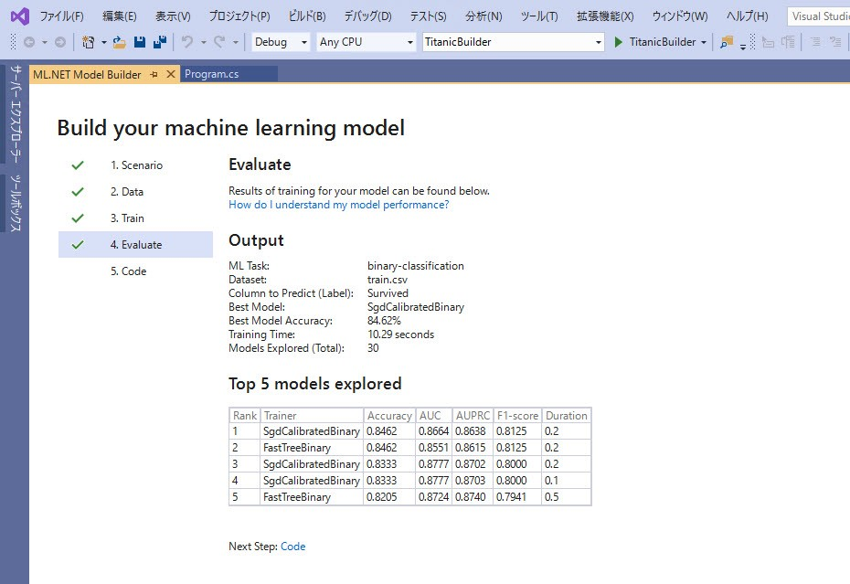

# ML.NET Model Builder で二項分類 ～ タイタニック号から脱出できるか？

このコンテンツでは、[**ML.NET Model Builder**](https://dotnet.microsoft.com/apps/machinelearning-ai/ml-dotnet/model-builder) を使って 二項分類 を行う手順を紹介します。

このコンテンツのテーマは、**タイタニック号の乗船リスト** から、どのような属性の人が **"助かる" かを予測** することです。

ML.NET Model Builder は、マウス操作だけで学習が完了し、複数のアルゴリズムでの学習の比較まで行います。

このコンテンツでは、Visual Studio 2017 (15.9.12 以上) または Visual Studio 2019 を使用します。

> 同様の分類モデルを作成する手順として、
>
> - [**Azure Machine Learning Studio** を使用するコンテンツ](https://github.com/seosoft/Titanic_MachineLearningStudio)
> - [**Azure Machine Learning Service Visual interface** を使用するコンテンツ](https://github.com/seosoft/Titanic_MLServiceVisualInterface)
> - [**ML.NET** を使用するコンテンツ](https://github.com/seosoft/Titanic_MLNet)
>
> を用意しています。  
>
> ML.NET を使用するコンテンツは、フレームワークとして ML.NET を使用して、データセットの読み込みから学習まで全てコーディングします。  
> Model Builder ではこれらを内部で自動で行います。

---

今回は、データセットを **学習** してから、学習済みモデルを Azure Functions で **サービス化** する手順まで紹介します。

ML.NET Model Builder では、以下の流れ学習およびサービス化を行います。

1. [データを用意する](./01_preparedata.md)
2. [モデルを作成する](./02_buildmodel.md)
3. [予測をサービス化する](./03_createfunctions.md)
4. [予測サービスをクラウドに発行する](./04_deploytoazure.md)

---

間違いや更新の提案は、Issue、Pull Request でお知らせください。
